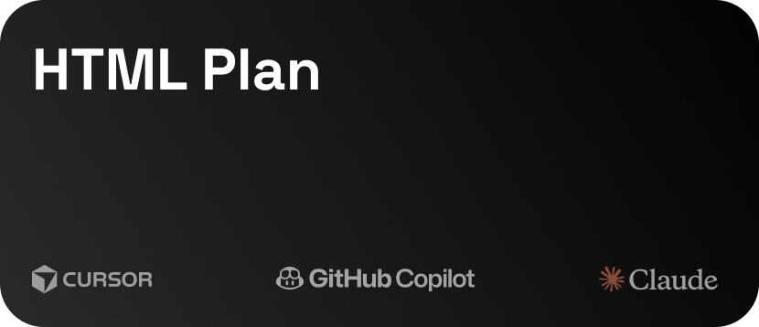
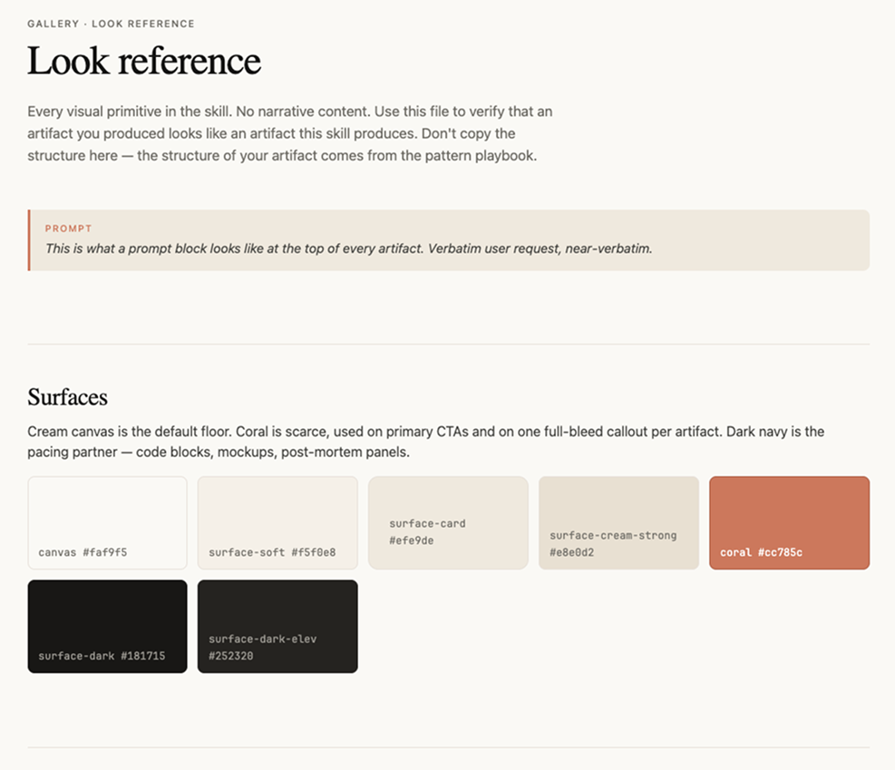
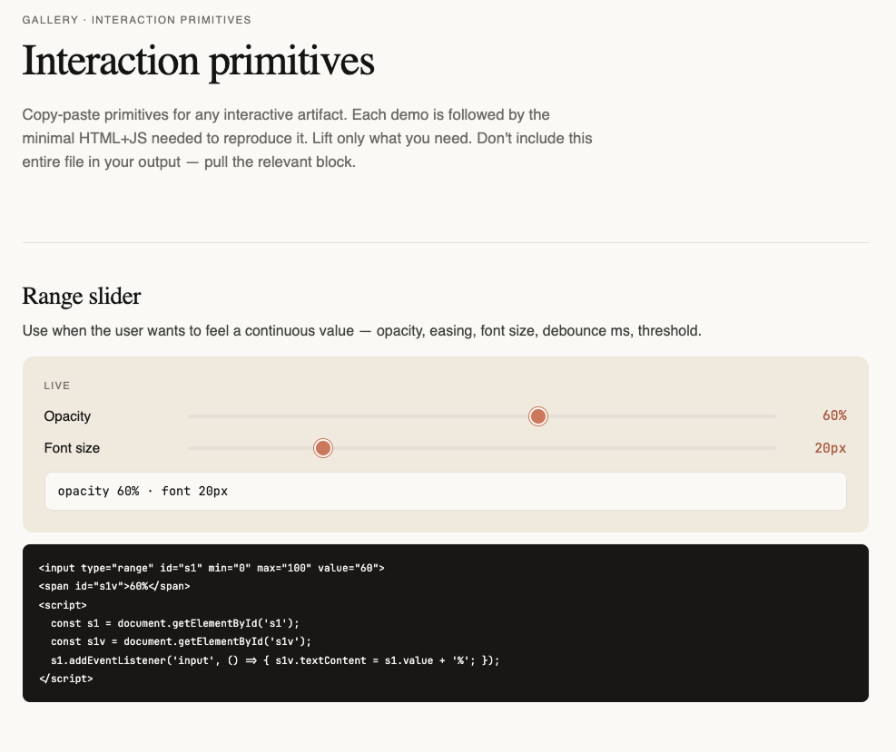
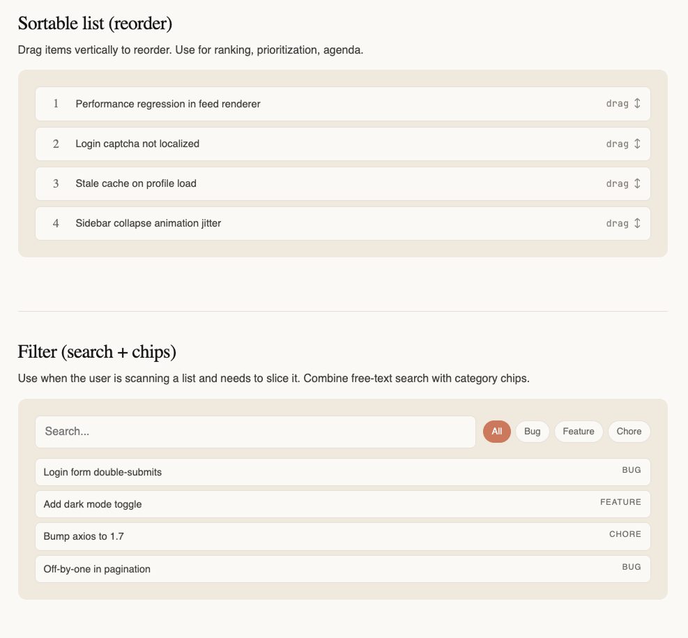

<p align="left">
  
</p>

<p align="left">
  <a href="https://github.com/julianoczkowski/html"></a>
  <a href="https://github.com/julianoczkowski/html"></a>
  <a href="#patterns"></a>
  <a href="https://github.com/vercel-labs/skills"></a>
  <a href="#installation"></a>
  <a href="#installation"></a>
  <a href="LICENSE"></a>
</p>

# HTML Skill for Claude Code & Cursor

A single agent skill that teaches your AI tool to produce a self-contained `.html` file instead of a markdown wall — when the underlying content has shape. Comparisons, plans, post-mortems, code reviews, triage boards, sortable tables, decks: each becomes a small, disposable HTML artifact you'd actually read.

Based on Thariq Shihipar's [_The unreasonable effectiveness of HTML_](https://thariqs.github.io/html-effectiveness/) — the observation that markdown flattens information that is inherently spatial, comparative, or interactive, and a small HTML file fixes this.

## Installation

```bash
npx skills add julianoczkowski/html
```

The interactive CLI will walk you through which agents to target (Claude Code, Cursor, Codex, Windsurf, and 40+ others) and whether to install at project or global scope.

### Manual install

The skill lives in the `html/` subdirectory of this repo. Copy just that folder:

```bash
# Personal (available across all projects)
git clone https://github.com/julianoczkowski/html /tmp/html-skill-src
cp -r /tmp/html-skill-src/html ~/.claude/skills/html
rm -rf /tmp/html-skill-src

# Project-scoped (checked into the repo)
mkdir -p .claude/skills
git clone https://github.com/julianoczkowski/html /tmp/html-skill-src
cp -r /tmp/html-skill-src/html .claude/skills/html
rm -rf /tmp/html-skill-src
```

## What this skill is for

**Agent-generated artifacts for a human reader.** Throwaway or reference, not production.

- **Working documents** the reader will act on (a plan, an options comparison, a PR writeup, a status report).
- **Reference pages** the reader will return to (a design-tokens page, a codemap, an explainer, a sortable table).
- **Throwaway tools** the reader uses for a few minutes and then exports out of (a triage board, a feature-flag toggler, a motion tuner).

What this is **not** for:

- **Production websites or apps** shipped to end users. Different skill, different concerns.
- **Long-form prose** without shape (an email, a paragraph of analysis). Use markdown.
- **Things that need persistence, multi-user state, or a backend.** State lives in memory and dies on refresh. The export button is how work survives.

## Patterns

Each pattern is a slash command. The skill routes from plain-language requests too — if you say "show me my options for X," it picks `/options` automatically.

### Universal patterns

| Command | When to use |
|---|---|
| **`/options`** | "Show me 2–4 ways to do X with trade-offs" — any decision before commitment. |
| **`/plan`** | A milestoned plan with timeline, mockups or sketches, and a risk table. |
| **`/status`** | Recurring report — weekly status, project update, post-mortem, retro. |
| **`/explainer`** | Layered explanation — TL;DR, collapsibles, tabs, glossary. |
| **`/deck`** | A short presentation, arrow-key navigable, single file. |
| **`/editor`** | Throwaway UI for editing the specific thing at hand, with export-back-to-text. |
| **`/diagram`** | Hand-rolled SVG diagrams — flowcharts, architecture, illustrative figures. |
| **`/table`** | Sortable, filterable tabular data — rows × columns with sort, search, filter, and CSV/markdown export. |

### Software-specific patterns

| Command | When to use |
|---|---|
| **`/pr`** | Code-review writeup — annotated diff or PR description. |
| **`/codemap`** | Onboarding to an unfamiliar codebase — boxes, arrows, hot path, entry points. |
| **`/tokens`** | Render a design system — live swatches, type ramp, component contact sheet. |
| **`/motion`** | UI animation sandbox or click-through where feel can't be described in prose. |

## Key Principles

### Every artifact is a single file

No build step, no dependencies, no remote assets. One `.html` you can open in a browser, mail to a colleague, drop into a Slack DM, or keep in a folder. State lives in memory; the artifact is throwaway.

### Information has shape

This skill is for content that is spatial, comparative, or interactive — a side-by-side, a timeline, a sortable table, a diagram, a draggable board. If the content is just sentences, markdown is the right surface. The pattern routing recognizes this: ask for "a paragraph" and the skill steps out of the way.

### Export back to text

Any artifact the user can _do something to_ (toggle, reorder, tune, edit) ends with an export button that emits the current state as something pasteable — markdown, JSON, a diff, a re-issuable prompt. The artifact is throwaway; the export is the durable output. This is the single most important convention in the skill.

### Locked editorial look

Every artifact uses the same restrained design system — warm cream canvas, muted coral accent, dark navy product surfaces, EB Garamond serif display, Inter body, JetBrains Mono code. The reader recognizes the genre on sight. Tokens live in `templates/base.html`; the `gallery/` folder shows the look in isolation.

### Gallery is look + interactions, not shape

The `gallery/` folder contains three reference files: `look.html` (color/type/components), `interactions.html` (sliders, toggles, drag-and-drop, filter bars, sortable lists), `navigation.html` (tabs, decks, sticky side-nav). When you ask for live tuning, the skill pulls the primitive from `interactions.html` instead of inventing one per artifact. Shape — what sections to include, what order — stays in the pattern playbooks.

<p align="left">
  
</p>

<p align="left">
  
</p>

<p align="left">
  
</p>

### Combining patterns is normal

Real requests cross pattern boundaries. The skill picks one primary pattern by which most determines shape, and borrows components from the secondary:

- **`/plan` + `/options`** — a plan with three candidate approaches for the contested decision.
- **`/explainer` + `/diagram`** — most good explainers have one or two diagrams embedded.
- **`/status` + `/diagram`** — a post-mortem with an architecture diagram showing where the failure was.
- **`/editor` + `/options`** — drag items into "keep" or "cut" piles, export both lists.

## Project Organization

The repo root carries metadata (this README, LICENSE, SECURITY, screenshots). The skill itself lives in `html/`, which is what `npx skills add` copies into `~/.claude/skills/html/`:

```
.                             ← repo root (this is what you see on GitHub)
├── README.md
├── LICENSE
├── SECURITY.md
├── *.png                     hero + screenshots used in this README
└── html/                     ← THE SKILL — installed to ~/.claude/skills/html/
    ├── SKILL.md              umbrella: philosophy, scope, conventions, router
    ├── patterns/             per-pattern playbooks (also slash commands)
    │   ├── options.md        → /options
    │   ├── plan.md           → /plan
    │   ├── status.md         → /status
    │   ├── explainer.md      → /explainer
    │   ├── deck.md           → /deck
    │   ├── editor.md         → /editor
    │   ├── diagram.md        → /diagram
    │   ├── table.md          → /table
    │   ├── pr.md             → /pr
    │   ├── codemap.md        → /codemap
    │   ├── tokens.md         → /tokens
    │   └── motion.md         → /motion
    ├── templates/
    │   └── base.html         shared boilerplate, color tokens, utility-class kit
    └── gallery/              look + interaction references (not shape)
        ├── look.html         swatches, type ramp, callouts, cards, timeline
        ├── interactions.html sliders, toggles, drag-and-drop, sort, filter
        └── navigation.html   tabs, deck, side-nav, anchor row, details
```

Pattern playbooks (70–150 lines each) own the **structural skeleton** of each artifact. `base.html` owns the **look**. The gallery files are **references** — patterns point at them so the model doesn't reinvent the same primitive twelve different ways.

## Customizing for your team

Two places to edit:

- **`templates/base.html`** — swap the color palette for your design system's tokens, change the font stack, adjust max-width. Everything inherits from this.
- **Individual patterns** — if your team has specific structure for, say, weekly status (custom sections, specific metrics in the at-a-glance row), edit `patterns/status.md` to encode it.

## Security

These files are **instructions for local AI tools**. Treat them like any other project dependency: **review** the skill before using it in sensitive or production contexts, and keep your editor, CLI, and API keys on trusted machines. We welcome **responsible disclosure** of anything in this repo that could cause agents to act unsafely; please use the process in [SECURITY.md](SECURITY.md) instead of public issues. Licensing and disclaimer: [LICENSE](LICENSE) (MIT).

## Credits

- Premise from Thariq Shihipar's [_The unreasonable effectiveness of HTML_](https://thariqs.github.io/html-effectiveness/) ([repo](https://github.com/ThariqS/html-effectiveness)).
- Editorial look adapted from the [Anthropic Claude](https://claude.com) design system — cream canvas, coral accent, EB Garamond display, Inter body.
- Packaged for the Vercel [skills CLI](https://github.com/vercel-labs/skills) by [Julian Oczkowski](https://youtube.com/@aiforwork_app).
